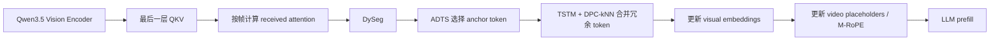

# FlashVID Vision Encoder 压缩复现实验记录

**项目**：FlashVID vision-encoder / before-LLM compression for Qwen3.5-4B  
**实验日期**：2026-07-31  
**代码仓库**：[Seven-creater/flashvid](https://github.com/Seven-creater/flashvid)  
**参考论文**：[FlashVID: Efficient Video Large Language Models via Training-free Tree-based Spatiotemporal Token Merging](https://arxiv.org/abs/2602.08024)  
**参考实现**：[Fanziyang-v/FlashVID](https://github.com/Fanziyang-v/FlashVID)

## 1. 任务要求

本次任务的验收目标是：

1. 复现 FlashVID 的视觉侧压缩，目标模型为 `Qwen/Qwen3.5-4B`。
2. 只实现 Vision Encoder/Before-LLM Compression，不实现 Inner-LLM token pruning。
3. 保留视觉压缩中的 ADTS 和 TSTM 两个步骤，并移植所需的 DySeg、DPC-kNN。
4. 改造成 vLLM out-of-tree 模型插件，兼容 OpenAI `/v1/chat/completions` 接口。
5. 增加视觉保留比例参数 `--vision-retention-ratio`。
6. 尽量使用 GPU 并行推理，并验证 DP=1/2/4/8 的部署吞吐。
7. 在本地开发、推送 GitHub，在服务器工作区拉取、下载模型并运行测试。
8. 不修改既有数据集和模型目录；服务器环境、缓存、日志和结果放在新项目目录内。

## 2. 范围与设计取舍

### 已实现

- Vision Encoder 最后一层 QKV 的逐帧视觉注意力提取。
- DySeg 动态时间分段。
- ADTS attention-and-diversity token selection。
- TSTM tree-based spatiotemporal token merging。
- DPC-kNN 空间上下文聚合。
- 视觉占位 token 数量更新。
- M-RoPE 时间/空间位置重算。
- DeepStack 特征通道同步处理（Qwen3.5-4B 官方配置当前没有启用 DeepStack 层，但实现保留兼容路径）。
- vLLM 0.25.1 自定义架构 `FlashVIDQwen3_5ForConditionalGeneration`。
- `retention_ratio=1.0` 的精确绕过路径。

### 明确未实现

- `fastv_prune`。
- `pruning_layer`。
- `llm_retention_ratio`。
- LLM 层内部 token pruning。
- 论文完整数据集评测和训练流程。

固定的视觉压缩参数为：

| 参数 | 值 |
| --- | ---: |
| ADTS `alpha` | 0.7 |
| temporal threshold | 0.8 |
| segment threshold | 0.9 |
| minimum segments | 4 |
| token selection | `attn_div` |
| Inner-LLM expansion | 不使用 |

## 3. 实现方案

### 3.1 压缩流程



压缩模块位于 `src/flashvid/compression.py`，vLLM 适配位于
`src/flashvid_vllm/model.py`。为避免在不同帧之间串行等待，视觉注意力的
矩阵乘法按帧批量执行，并使用 query chunk 控制显存峰值。

### 3.2 vLLM 集成

采用 out-of-tree 注册方式，不复制或修改完整 vLLM 源码：

- 通过模型插件注册自定义架构。
- `flashvid-serve` 将保留比例转换为 vLLM 的 `video_pruning_rate`，确保视觉占位 token 和实际 embedding 数量同步。
- 视频请求进入压缩路径；图片和纯文本请求沿用原始路径。
- 为兼容 vLLM 的动态多模态占位机制，每个采样时间位置至少保留一组空间 token。
- 8 卡服务器采用 `DP=8、TP=1`，每张 A6000 一个 Qwen3.5-4B 副本。

## 4. 实施进展

| 阶段 | 工作 | 状态 |
| --- | --- | --- |
| 1 | 调研论文、上游仓库和 vLLM 0.25.1 多模态接口 | 完成 |
| 2 | 移植 DySeg、ADTS、TSTM、DPC-kNN | 完成 |
| 3 | 接入 Qwen3.5 Vision Encoder 最后一层 QKV | 完成 |
| 4 | 同步 placeholders、M-RoPE、DeepStack | 完成 |
| 5 | 注册 vLLM out-of-tree 自定义架构和 CLI 参数 | 完成 |
| 6 | 本地单元测试和范围检查 | 完成，16 项通过 |
| 7 | 服务器环境、CUDA 兼容库和模型准备 | 完成 |
| 8 | 真实 Qwen3.5-4B API 验证 | 完成 |
| 9 | DP=1/2/4/8 吞吐测试 | 完成 |
| 10 | GitHub 推送、服务器拉取和实验报告 | 完成 |

主要提交：

- `2e342e2`：初始 FlashVID vision compression + vLLM 插件。
- `7b7c3d7`：并行化视觉注意力计算。
- `8e7a37a`：修复 CUDA 13 JIT runtime 对齐。
- `2f90ebc`：增加多视频 smoke 测试。
- `6e772da`：加入服务器验证报告并完成最终同步。

## 5. 遇到的问题与解决方法

### 问题一：服务器 SSH 别名不可用

原计划中的 SSH 别名没有在当前环境解析成功。通过实际检查确认服务器地址为
`10.1.4.86`，后续使用该地址完成拉取、安装和测试。

### 问题二：主机驱动与 PyTorch/CUDA 版本不匹配

服务器驱动报告 CUDA 12.2，而 vLLM wheel 使用 CUDA 13 runtime；直接启动时出现
“NVIDIA driver is too old”。

解决方法：在项目 `.venv` 内安装 `cuda-compat=13.0.2`，并在启动器中加入项目级
`LD_LIBRARY_PATH`。不修改系统驱动，不需要 root 权限。之后 PyTorch GPU 初始化成功。

### 问题三：FlashInfer 使用了系统 CUDA 11.8 的 nvcc

即使 GPU 初始化成功，FlashInfer JIT 仍从系统 PATH 找到了 CUDA 11.8，造成 CUDA
头文件和编译器版本不一致。

解决方法：让 `flashvid-serve` 显式设置：

- `CUDA_HOME` 指向 vLLM wheel 提供的 CUDA 13 toolkit。
- `FLASHINFER_NVCC` 指向该 toolkit 的 `nvcc`。
- `PATH` 优先使用项目虚拟环境中的 CUDA bin。

### 问题四：CUDA 13.0 头文件与 CUDA 13.2 nvcc 不一致

FlashInfer 编译阶段继续报告 `CUDA_VERSION` mismatch。检查发现 vLLM 依赖的
runtime headers 为 13.0，而 wheel 中的 nvcc 为 13.2。

解决方法：在 `setup_server.sh` 中固定安装
`nvidia-cuda-runtime==13.2.86`，使编译器与 headers 对齐。

### 问题五：FlashInfer 链接阶段找不到 `libcudart.so`

wheel 目录只有 `libcudart.so.13` 和 `lib/`，而部分 JIT 构建逻辑查找
`lib64/libcudart.so`。

解决方法：在项目虚拟环境中创建兼容软链接：

- `nvidia/cu13/lib64 -> lib`
- `lib/libcudart.so -> libcudart.so.13`
- `lib/libcuda.so -> .venv/cuda-compat/libcuda.so`

这些改动均限定在项目目录内。

### 问题六：停止旧服务后端口仍被占用

只结束 `flashvid-serve` 父进程时，vLLM 的 API server 和 EngineCore 子进程仍然存在，
导致新服务报 `Address already in use`。

解决方法：服务使用 `setsid` 建立独立进程组，停止时按 PGID 发送 TERM；确认
`ss -ltnp` 不再占用端口后再启动下一组实验。

### 问题七：原生 vLLM 基线没有继承项目 CUDA 环境

直接调用 `.venv/bin/vllm` 做 ratio-1.0 基线时，FlashInfer 又回退到系统 CUDA 11.8。

解决方法：基线启动同样显式传递项目 CUDA toolkit、`FLASHINFER_NVCC` 和
`LD_LIBRARY_PATH`，最终原生 Qwen3.5 服务成功启动。

### 问题八：DP 服务首次启动耗时较长

DP=2/4/8 首次启动会并行加载多份模型，并触发 Torch/FlashInfer 编译；日志中出现
shared-memory broadcast 等待信息，但没有 OOM 或失败。

解决方法：将启动、编译和测试全部放到 `nohup + setsid` 后台，等待服务健康检查
返回 200 后再发起请求。编译缓存保存在项目 `.cache`，后续启动可复用。

### 问题九：压缩统计日志未按预期显示

普通 Python logger 在 vLLM 多进程环境中没有显示 INFO 级别的自定义模型日志。

解决方法：改用 `vllm.logger.init_logger`，并将单视频压缩统计提升为 warning 级别，
以便在服务日志中确认压缩前后 token 数和耗时。

## 6. 实验结果

### 6.1 自动化测试

本地和服务器均执行：

```text
16 passed
```

测试覆盖压缩核心、ADTS 索引、TSTM 合并、DPC-kNN 确定性、预算控制、ratio-1.0
绕过路径，以及禁止 Inner-LLM pruning 关键字重新进入代码树的范围检查。

### 6.2 API 功能测试

真实 Qwen3.5-4B 权重全部通过：

| 输入类型 | 结果 |
| --- | --- |
| 纯文本 | 通过 |
| 单图片 | 通过 |
| 单视频 | 通过 |
| 同一请求两个视频 | 通过 |
| dummy 权重插件启动 | 通过 |
| ratio-1.0 原生基线对照 | 通过 |

### 6.3 视觉 token 数

同一视频、相同 prompt 下的 API prompt token 数如下：

| Vision retention ratio | Prompt tokens |
| ---: | ---: |
| 1.00 | 11,671 |
| 0.50 | 6,163 |
| 0.25 | 3,409 |
| 0.10 | 1,756 |

该样例经过的视频采样时间位置较少，并且实现保留每个时间位置的最小空间 token
组，因此 0.10 的实际 token 数不一定严格等于原始视觉 token 的 10%；这是为了保证
视频时间轴和 M-RoPE 结构有效。对更长视频，比例会更接近设定值。

ratio-1.0 插件和原生 Qwen3.5 的测试结果具有相同 prompt token 数和 greedy 生成
内容，作为原始模型基线对照通过。

### 6.4 并行吞吐

测试使用相同视频 URL、`temperature=0`、每请求生成 32 tokens；DP=1/2 使用 16 个
请求，DP=4/8 使用 32 个请求。重复媒体会命中 vLLM 多模态缓存，以下是服务吞吐，
不是单次视觉编码的独立微基准。

| DP | 请求数 | 并发数 | 成功数 | Requests/s | Output tok/s | TTFT p50 |
| ---: | ---: | ---: | ---: | ---: | ---: | ---: |
| 1 | 16 | 8 | 16 | 1.81 | 57.95 | 2.59 s |
| 2 | 16 | 8 | 16 | 1.65 | 52.74 | 3.83 s |
| 4 | 32 | 16 | 32 | 2.63 | 84.24 | 4.86 s |
| 8 | 32 | 16 | 32 | **3.29** | **105.15** | 2.95 s |

最终推荐配置为 `DP=8、TP=1`。DP8 启动后每张卡约使用 40.8 GiB（包含模型、运行时
和缓存），所有请求均无 OOM、无失败。

## 7. 当前部署与复现命令

服务器项目目录：

```text
/data02/usr/wangqihao/Demo/test/flashvid
```

模型、缓存、日志和结果都位于该项目目录；原有数据集目录未修改。

启动推荐的 8 卡服务：

```bash
cd /data02/usr/wangqihao/Demo/test/flashvid
nohup setsid bash scripts/serve_dp8.sh 0.10 \
  > logs/serve_dp8-background.log 2>&1 < /dev/null &
```

发起 smoke 请求：

```bash
.venv/bin/python scripts/smoke_openai.py \
  --base-url http://127.0.0.1:8000 \
  --model qwen3.5-4b-flashvid \
  --video-url http://127.0.0.1:8765/Qgr4dcsY-60.mp4
```

运行并发基准：

```bash
.venv/bin/python scripts/benchmark_openai.py \
  --base-url http://127.0.0.1:8000 \
  --model qwen3.5-4b-flashvid \
  --video-url http://127.0.0.1:8765/Qgr4dcsY-60.mp4 \
  --requests 32 --concurrency 16 --max-tokens 32 \
  --output results/benchmark.json
```

## 8. 结论与后续工作

本次已经完成 Vision Encoder 压缩的工程复现、Qwen3.5-4B vLLM 部署、视觉比例
参数、服务器后台运行和 DP8 吞吐验证。ADTS+TSTM 视觉压缩可以在不改动 LLM 内部
pruning 的前提下接入 Qwen3.5-4B，并保持标准 OpenAI API 形式。

后续若需要进一步提高吞吐，建议按真实业务的视频长度和并发分布重新扫描
`max-num-seqs`、`max-num-batched-tokens`、视频采样帧数与多模态缓存策略；论文级
多数据集准确率评测则需要另外准备完整评测数据和统一的生成/评分脚本。
